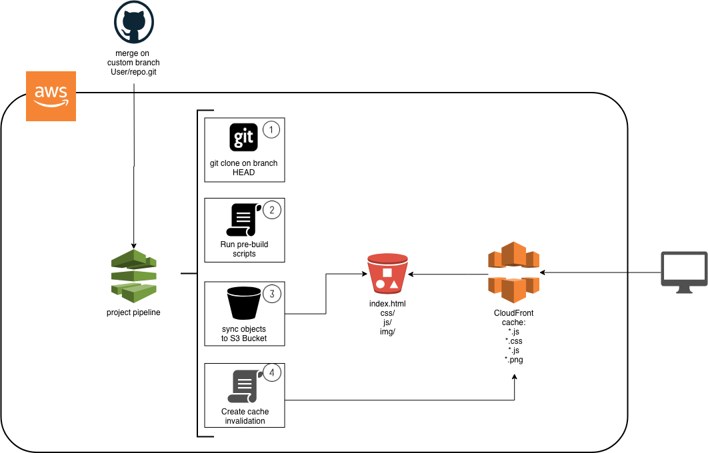
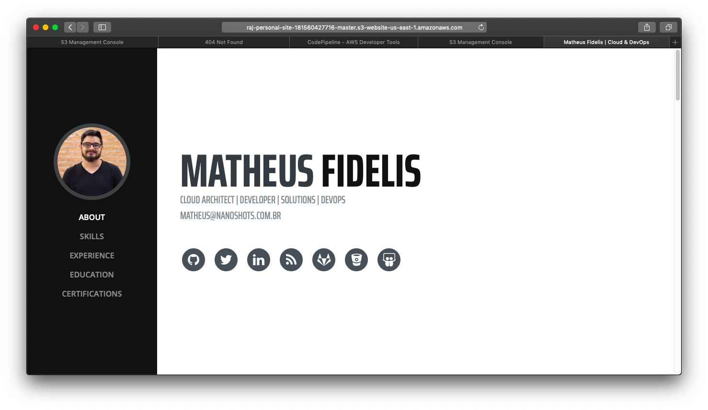

## Bootstraping the easy way to deploy Static Sites on S3

> This is a reference to scale DevOps Workflows to Designers and Front End Developers to prototyping, validate and deploy landing pages, React, Vue, Angular Apps.

## 1. Stack

Issue | Technology
------------ | -------------
Git Manager | Github 
Infrastructure as Code Framework | Terraform - Hashicorp Cloud IaC Manager
Pipeline / Build Platform | CodePipeline + CodeBuild from AWS
Hosting System | Amazon S3 -  Low Cost Object Storage with Website feature on AWS
Caching / CDN System | Amazon Cloudfront - AWS Global Content Delivery Network 


## 2. Basic Architecture



## 3. Project Configuration

Edit the `config.tf` file and input the Github, Project Name, Develop and Production branches e etc.

Example:

```hcl
variable "app_name" {
  description = "Website project name"
  default     = "raj-personal-site"
}

variable "aws_region" {
  description = "AWS Region for the VPC"
  default     = "us-east-1"
}

variable "git_repository_owner" {
  description = "Github Repository Owner"
  default     = "msfidelis"
}

variable "git_repository_name" {
  description = "Project name on Github"
  default     = "msfidelis.github.io"
}

variable "git_repository_branch" {
  description = "Github Project Branch"
  default     = "master"
}

# Optional
variable "git_repository_dev_branch" {
  description = "Github Project Branch"
  default     = "develop"
}
```

## 2. Setup Github Access Token

* Create your Github Access Token to Command Line. [This link have all information about this](https://help.github.com/articles/creating-a-personal-access-token-for-the-command-line/).


* Export Github Token as an environment variable. 

```bash
export GITHUB_TOKEN=YOUR_TOKEN
``` 

## 3. Validate and Deploy

* Initialize Terraform

```bash
terraform init
```

* Plan our modifications

```bash
terraform plan
```

* Apply the changes on AWS

```bash
terraform apply
```

